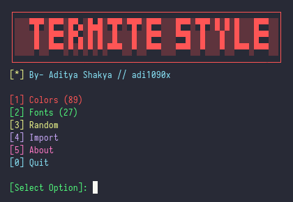
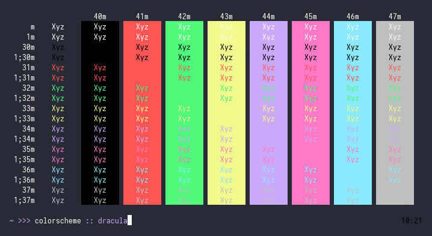
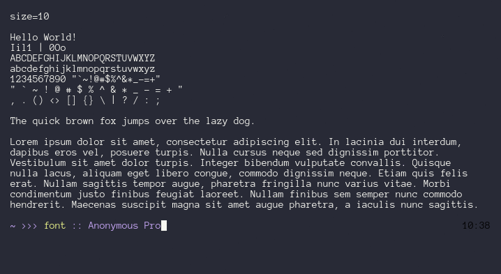

<!-- Links -->
[bmac]: https://www.buymeacoffee.com/adi1090x
[ko-fi]: https://ko-fi.com/adi1090x
[paypal]: https://www.paypal.com/cgi-bin/webscr?cmd=_s-xclick&hosted_button_id=U3VK2SSVQWAPN
[patreon]: https://www.patreon.com/adi1090x

# Termite Style

<p align="left">
  
  
  
  
  
</p>

Simple script to change color-schemes and fonts for [Termite](https://github.com/thestinger/termite).

 <br />

### How to install

Follow the steps below - 

```bash
# go to home dir - 
cd $HOME

# clone this repository - 
git clone https://github.com/adi1090x/termite-style

# change to termite-style dir -
cd termite-style

# to install it, run -
./install

# And Follow the steps, it'll be installed on your system.
```

### Run

Run `termite-style` & select the right option -

```bash
$ termite-style

    ┌──────────────────────────────────────────────────────┐
    │░░░▀█▀░█▀▀░█▀▄░█▄█░▀█▀░▀█▀░█▀▀░░░█▀▀░▀█▀░█░█░█░░░█▀▀░░│
    │░░░░█░░█▀▀░█▀▄░█░█░░█░░░█░░█▀▀░░░▀▀█░░█░░░█░░█░░░█▀▀░░│
    │░░░░▀░░▀▀▀░▀░▀░▀░▀░▀▀▀░░▀░░▀▀▀░░░▀▀▀░░▀░░░▀░░▀▀▀░▀▀▀░░│
    └──────────────────────────────────────────────────────┘
    [*] By- Aditya Shakya // adi1090x

    [1] Colors (89)
    [2] Fonts (27)
    [3] Random
    [4] Import
    [5] About
    [0] Quit
    
    [Select Option]: 
```

### Features

+ 90 popular color-schemes.
+ 20+ powerline patched fonts.
+ Randomly change color-schemes.
+ Import color-schemes from *local file* or *file URL*.
+ Set colors and fonts in place.

### Use Import
```bash
    [Select Option]: 4

    [1] Local File (Enter path to file)
    [2] Internet File (Enter File URL)

    [Select Option]: 2

    [Enter Color-scheme URL]: https://raw.githubusercontent.com/adi1090x/tRandomizer/master/colors/110.color

    [*] Reloading Settings...
    [*] Applied Successfully.
```

+ To import *local file*, enter the full path (ie - `/home/aditya/batman.conf`) of the color-scheme.
+ To import *web file*, enter the file url (ie - `https://raw.githubusercontent.com/adi1090x/tRandomizer/master/colors/110.color`) of the color-scheme.
+ You can generate color-schemes from [terminal.sexy](https://terminal.sexy/) and export it to a file in termite format, then import it in `termite-style`.
+ I've already generated 500 random color-schemes from *terminal.sexy*, which you can get [here](https://github.com/adi1090x/tRandomizer/tree/master/colors), just copy the ***[raw file url](https://raw.githubusercontent.com/adi1090x/tRandomizer/master/colors/121.color)*** and paste it in `termite-style`.
<br />

|Sample - Colorschemes|Sample - Fonts|
|--|--|
|||

### FYI
- This note is for people with *weak heart*, the `install` script will need the **sudo** permission, because this program puts colors and fonts files inside the *"/usr/share"* directory. So, before asking me "why dafuq this need sudo?"... **Read the code.**
- An `uninstall` script is also added, in case you want to remove this program.
- Again... If you can improve it, sure...
- Have fun!
